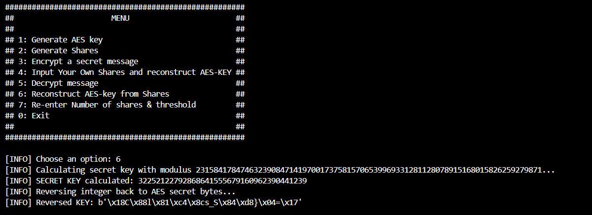
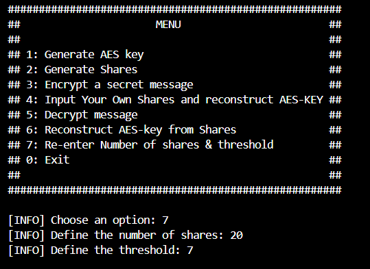

# Install Dependancies

    pip install pycryptodome
    pip install sympy
    pip install hashlib

# Run Script
run:

    python main.py

You will be prompted to input 2 values in the beginning:

    a. Number of shares : This is the number of total shares your secret has/will have
    b. Threshold : This is the amount of shares needed to recover the Secret text

You will be led to a menu of choices:

## Option 1: Generate AES key

if you have no AES key this option generates one for you it will use the AES python library to generate 16 random bytes, and converts it to an integer

The first key is the 16 random bytes, the second key is these bytes in integer format

## Option 2: Generate Shares

This option generates 'n' shares (the number of shares you input earlier) from your secret in a (x, y) format     

## Option 3: Encrypt a secret message 

This option encrypts a secret message you input using the AES key in memory

*note:* Make sure the AES key is calculated *option: 4* or an AES key is generated *option 1*

## Option 4: Input Your Own Shares and reconstruct AES-KEY

This option allows you to input shares of a secret AES key to then calculate the original secret

*note:* Make sure the threshold is correct, you can change it with *option: 7*

## Option 5: Decrypt message

This option allows you to input the encrypted message to then decrypt it with the AES key

*note:* Make sure the AES key is calculated *option: 4* or an AES key is generated *option 1*
*note:* Make sure you input the AES key and Tag in a hexadecimal format

## Option 6: Reconstruct AES-key from Shares 

This option reconstructs the secret from the shares that are saved in memory, eg. you just used option 1 and 2, the shares calculated are now stored in the class, this is used to test that the script can recalculate secrets from shares.

## Option 7: Re-enter Number of shares & threshold

This option allows you to re-enter the threshold amount needed to calculate a secret and the number of shares calculated from a secret

sources:
    - https://mathworld.wolfram.com/LagrangeInterpolatingPolynomial.html