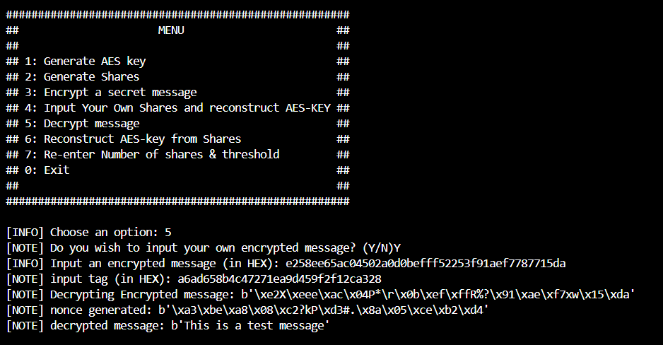

# Install Dependancies

    pip install pycryptodome

# Run Script
run:

    python main.py

You will be prompted to input 2 values in the beginning:

    a. Number of shares : This is the number of total shares your secret has/will have
    b. Threshold : This is the amount of shares needed to recover the Secret text

You will be led to a menu of choices:

## Option 1: Generate secret

if you have no secret this option generates one for you it will use the AES python library to generate 4 random bytes

The script sadly cant handel large numbers and the acuracy decreases the larger the secret is, this is due to when using large numbers, floating-point arithmetic can introduce rounding errors, which can result in a really similar recalculated key but the last few digits might be wrong, so far the script only seems to work with 4 byte secrets.

## Option 2: Generate Shares

This option generates 'n' shares (the number of shares you input earlier) from your secret in a (x, y) format     

## Option 3: Input Your Own Shares and reconstruct Secret

This option allows you to input shares of a secret that you own to then calculate the original secret
    

*note:* Make sure the threshold is correct, you can change it with *option: 5*

## Option 4: Reconstruct Secret from Shares

This option reconstructs the secret from the shares that are saved in memory, eg. you just used option 1 and 2, the shares calculated are now stored in the class, this is used to test that the script can recalculate secrets from shares.

## Option 5: Re-enter Number of shares & threshold

This option allows you to re-enter the threshold amount needed to calculate a secret and the number of shares calculated from a secret

sources:
    - https://mathworld.wolfram.com/LagrangeInterpolatingPolynomial.html